# TÀI LIỆU ĐẶC TẢ YÊU CẦU PHẦN MỀM
## Dự án: Nền tảng Đánh Cờ Vua Trực tuyến Thời gian thực tích hợp Trí tuệ Nhân tạo
**Quy cách tài liệu:** Biên soạn dựa trên hướng dẫn mẫu IEEE 830 và tài liệu tham khảo thực tế  
**Phiên bản:** 1.0  
**Tác giả thực hiện:** Phan Hồng Sơn (Mã sinh viên: 174765 - Lớp: 65PM-CNVLVH)  
**Đơn vị hướng dẫn:** Công ty Cổ phần VTI  
**Cán bộ hướng dẫn tại đơn vị:** Đinh Văn Đông (Trưởng nhóm Kỹ thuật)  
**Giảng viên hướng dẫn:** Thạc sĩ Nguyễn Hải Dương  
**Cơ sở đào tạo:** Trường Đại học Xây dựng Hà Nội  

---

## MỤC LỤC
1. [GIỚI THIỆU](#1-giới-thiệu)
   - 1.1 [Mục đích](#11-mục-đích)
   - 1.2 [Phạm vi hệ thống](#12-phạm-vi-hệ-thống)
   - 1.3 [Bảng thuật ngữ và định nghĩa](#13-bảng-thuật-ngữ-và-định-nghĩa)
   - 1.4 [Tài liệu tham khảo](#14-tài-liệu-tham-khảo)
   - 1.5 [Tổng quan tài liệu](#15-tổng-quan-tài-liệu)
2. [YÊU CẦU CHỨC NĂNG](#2-yêu-cầu-chức-năng)
   - 2.1 [Các tác nhân hệ thống](#21-các-tác-nhân-hệ-thống)
   - 2.2 [Danh mục chức năng tổng quan](#22-danh-mục-chức-năng-tổng-quan)
   - 2.3 [Biểu đồ Use Case tổng quan](#23-biểu-đồ-use-case-tổng-quan)
   - 2.4 [Biểu đồ Use Case phân rã cho từng tác nhân](#24-biểu-đồ-use-case-phân-rã-cho-từng-tác-nhân)
   - 2.5 [Biểu đồ trình tự các luồng nghiệp vụ cốt lõi](#25-biểu-đồ-trình-tự-các-luồng-nghiệp-vụ-cốt-lõi)
   - 2.6 [Bảng đặc tả Use Case chi tiết](#26-bảng-đặc-tả-use-case-chi-tiết)
   - 2.7 [Bảng ma trận kịch bản kiểm thử](#27-bảng-ma-trận-kịch-bản-kiểm-thử)
3. [YÊU CẦU PHI CHỨC NĂNG](#3-yêu-cầu-phi-chức-năng)
   - 3.1 [Giao diện người dùng](#31-giao-diện-người-dùng)
   - 3.2 [Hiệu năng hệ thống](#32-hiệu-năng-hệ-thống)
   - 3.3 [Độ tin cậy và tính sẵn sàng](#33-độ-tin-cậy-và-tính-sẵn-sàng)
   - 3.4 [An toàn và bảo mật dữ liệu](#34-an-toàn-và-bảo-mật-dữ-liệu)
   - 3.5 [Khả năng mở rộng](#35-khả-năng-mở-rộng)

---

# 1. GIỚI THIỆU

### 1.1 Mục đích
Tài liệu đặc tả yêu cầu phần mềm này trình bày chi tiết các yêu cầu chức năng, yêu cầu phi chức năng cùng các mô hình hành vi, kịch bản tương tác và tiêu chí kiểm thử cho hệ thống Nền tảng Đánh Cờ Vua Trực tuyến Thời gian thực. Tài liệu được xây dựng nhằm làm cơ sở kỹ thuật thống nhất giữa tác giả, giảng viên hướng dẫn và đơn vị thực tập trong các giai đoạn phân tích thiết kế, lập trình, kiểm thử và nghiệm thu sản phẩm phần mềm.

### 1.2 Phạm vi hệ thống
Hệ thống là một giải pháp trực tuyến đa người dùng trên nền tảng Web, phục vụ nhu cầu thi đấu cờ vua, rèn luyện kỹ năng và giải trí tương tác cao:
- **Thi đấu với máy tính:** Tích hợp thuật toán Negamax kết hợp cắt tỉa Alpha-Beta chạy trên luồng ngầm của trình duyệt, cung cấp 3 cấp độ chơi từ dễ đến khó mà không làm gián đoạn giao diện bàn cờ.
- **Thi đấu trực tuyến giữa người với người:**
  - Chế độ ghép trận xếp hạng tự động: Tìm kiếm đối thủ có trình độ tương đương trong hàng chờ máy chủ và tính toán biến thiên điểm Elo sau mỗi ván đấu theo luật của Liên đoàn Cờ vua Quốc tế.
  - Chế độ tạo phòng bạn bè: Tạo phòng đấu riêng với mã phòng gồm 6 ký tự để người chơi giao hữu mà không ảnh hưởng đến điểm xếp hạng.
- **Đồng bộ thời gian thực và kiểm soát luật cờ:**
  - Toàn bộ nước đi được máy chủ kiểm tra tính hợp lệ trước khi chấp nhận và phát tán tới đối thủ qua WebSocket.
  - Giải thuật đồng hồ thi đấu hướng sự kiện: Máy chủ chỉ ghi nhận các mốc thời gian chuyển lượt, tính toán và trừ thời gian suy nghĩ một lần khi nhận nước đi hợp lệ, kết hợp bộ hẹn giờ giám sát hết giờ nhằm tiết kiệm tài nguyên vi xử lý máy chủ.
  - Cơ chế khôi phục trạng thái ván cờ trong 45 giây: Khi người chơi mất kết nối mạng hoặc tải lại trang web, máy chủ duy trì ván cờ và đếm lùi thời gian cho phép người chơi vào lại mà không bị xử thua ngay lập tức.
- **Tổ chức giải đấu loại trực tiếp:** Hỗ trợ quy mô 4 hoặc 8 kỳ thủ với sơ đồ phân nhánh tự động. Khi ván đấu chính hòa, hệ thống tự động khởi tạo ván phụ thi đấu nhanh với màu quân đảo chiều và áp dụng lợi thế hòa cờ cho bên cầm quân Đen để xác định người chiến thắng đi tiếp.
- **Xem lại và phân tích thế cờ:** Tích hợp Stockfish engine phiên bản WebAssembly giúp người chơi xem lại lịch sử nước đi, đánh giá chất lượng từng nước cờ thông qua chỉ số tổn thất ưu thế và phát hiện các sai lầm chiến thuật.
- **Học tập và giải đố cờ vua:** Ngân hàng 30 bài tập cờ thế chiến thuật phân bổ theo các dải trình độ từ 1000 đến 2050 Elo cùng hệ thống bài giảng tương tác giúp người mới bắt đầu làm quen luật chơi và nâng cao trình độ.
- **Hồ sơ kỳ thủ và phân tích phong cách bằng học máy:** Trích xuất 8 chỉ số đặc trưng thi đấu từ lịch sử các ván cờ gồm độ mất điểm thế cờ trung bình và tỉ lệ sai sót qua 3 giai đoạn khai cuộc, trung cuộc, tàn cuộc; thời gian suy nghĩ trung bình; tỉ lệ sai sót khi cạn giờ. Áp dụng mô hình K-Means và bộ chuẩn hóa StandardScaler để phân cụm người chơi vào 4 nhóm phong cách: Tiến công, Toàn diện, Đột biến và Phòng thủ. Hệ thống đồng thời chẩn đoán giai đoạn thi đấu có hiệu suất thấp nhất để đề xuất các bài tập cờ thế chiến thuật phù hợp và hiển thị trực quan qua biểu đồ mạng nhện SVG 8 trục.
- **Quản lý tài khoản và bảo mật:** Xác thực danh tính với cơ chế bảo mật kết hợp mã truy cập ngắn hạn lưu trong bộ nhớ tạm và mã làm mới dài hạn lưu trong cookie bảo mật chỉ đọc, ngăn ngừa các nguy cơ khai thác trái phép qua mạng.

### 1.3 Bảng thuật ngữ và định nghĩa

| Thuật ngữ | Ý nghĩa và định nghĩa nghiệp vụ |
| :--- | :--- |
| **FIDE** | Liên đoàn Cờ vua Quốc tế, cơ quan ban hành luật cờ và quy tắc tính điểm xếp hạng toàn cầu. |
| **Elo** | Hệ thống đánh giá trình độ kỳ thủ dựa trên kết quả thi đấu đối kháng, điểm số tăng khi thắng và giảm khi thua. |
| **FEN** | Ký hiệu quy định cấu trúc chuỗi ký tự thể hiện vị trí toàn bộ quân cờ và trạng thái bàn cờ tại một thời điểm. |
| **PGN** | Định dạng văn bản quy định chuỗi nước đi và thông tin đi kèm của một ván cờ vua hoàn chỉnh. |
| **UCI** | Giao thức truyền thông giữa giao diện người dùng và các công cụ tính toán nước cờ. |
| **WASM** | Định dạng mã nhị phân hiệu năng cao thực thi trực tiếp trên trình duyệt web. |
| **Stockfish engine** | Động cơ phân tích thế cờ mã nguồn mở mã hóa sang WebAssembly thực thi trên Web Worker của trình duyệt. |
| **CPL** | Độ mất mát ưu thế của nước cờ đo bằng một phần trăm giá trị quy đổi của quân Tốt. |
| **PvAI** | Chế độ thi đấu giữa người chơi và máy tính. |
| **PvP** | Chế độ thi đấu đối kháng trực tiếp giữa hai người chơi thực. |
| **WebSocket** | Giao thức mạng cho phép truyền thông hai chiều thời gian thực giữa máy chủ và máy khách qua một kết nối duy nhất. |
| **JWT** | Định dạng mã định danh bảo mật dùng để xác thực và ủy quyền truy cập trong ứng dụng web. |
| **Ván phụ Armageddon** | Hình thức thi đấu ván phụ nhanh để phân định thắng thua khi hòa cờ, bên Trắng có nhiều thời gian hơn nhưng bên Đen có ưu thế hòa là thắng. |
| **K-Means** | Thuật toán học máy không giám sát dùng để nhóm tập dữ liệu thành K cụm dựa trên khoảng cách hình học tới tâm cụm. |
| **StandardScaler** | Kỹ thuật chuẩn hóa dữ liệu đưa kỳ vọng về 0 và phương sai về 1, loại bỏ sai lệch thang đo giữa các biến đặc trưng. |
| **Radar Chart** | Biểu đồ mạng nhện đa giác biểu diễn đồng thời nhiều biến định lượng trên cùng một hệ tọa độ cực. |

### 1.4 Tài liệu tham khảo
1. IEEE Std 830-1998: Hướng dẫn thực hành khuyến nghị cho đặc tả yêu cầu phần mềm của Viện Kỹ sư Điện và Điện tử.
2. FIDE Handbook: Luật thi đấu cờ vua của Liên đoàn Cờ vua Quốc tế.
3. Tài liệu kiến trúc và hướng dẫn đặc tả yêu cầu phần mềm tham khảo thực tế.
4. Báo cáo khảo sát nghiệp vụ và tài liệu kỹ thuật dự án Nền tảng Đánh Cờ Vua Trực tuyến.

### 1.5 Tổng quan tài liệu
Tài liệu này gồm 3 chương chính:
- **Chương 1 - Giới thiệu:** Trình bày mục đích, phạm vi, bảng thuật ngữ, tài liệu tham khảo và tổng quan cấu trúc.
- **Chương 2 - Yêu cầu chức năng:** Mô tả chi tiết các tác nhân hệ thống, danh mục chức năng, biểu đồ Use Case tổng quan và phân rã, biểu đồ trình tự 3 luồng nghiệp vụ cốt lõi, bảng đặc tả chi tiết 7 Use Case chính và ma trận 10 kịch bản kiểm thử thực tế.
- **Chương 3 - Yêu cầu phi chức năng:** Xác định các chỉ tiêu kỹ thuật về giao diện người dùng, hiệu năng, độ tin cậy và tính sẵn sàng, an toàn bảo mật dữ liệu cùng khả năng mở rộng hệ thống.

---

# 2. YÊU CẦU CHỨC NĂNG

### 2.1 Các tác nhân hệ thống
1. **Khách:** Người dùng truy cập website mà chưa thực hiện đăng nhập tài khoản. Khách có thể trải nghiệm các tính năng mở như đấu cờ với máy tính, giải các bài tập cờ thế cơ bản, học các bài giảng nhập môn và xem bảng xếp hạng kỳ thủ.
2. **Người chơi có tài khoản:** Người dùng đã hoàn tất đăng ký và đăng nhập vào hệ thống. Tác nhân này được sử dụng toàn bộ tính năng của khách, đồng thời có thể tham gia hàng chờ ghép trận xếp hạng có tính điểm Elo, tạo hoặc tham gia phòng đấu bạn bè bằng mã phòng, ghi danh thi đấu giải đấu loại trực tiếp, xem lại và phân tích chi tiết ván cờ đã đấu, cũng như lưu trữ tiến trình học tập cá nhân.
3. **Quản trị viên:** Người dùng có thẩm quyền cao nhất trong hệ thống, chịu trách nhiệm quản lý tài khoản người chơi, khóa hoặc mở khóa tài khoản vi phạm, quản lý ngân hàng bài học và thế cờ chiến thuật, đồng thời giám sát các phòng đấu và giải đấu đang diễn ra.

### 2.2 Danh mục chức năng tổng quan

| Nhóm chức năng | Mã chức năng | Tên chức năng | Tác nhân thực hiện |
| :--- | :--- | :--- | :--- |
| **Quản lý tài khoản** | FN-01 | Đăng ký tài khoản mới | Khách |
| | FN-02 | Đăng nhập hệ thống | Khách, Người chơi |
| | FN-03 | Đăng xuất | Người chơi, Quản trị viên |
| | FN-04 | Xem và cập nhật hồ sơ cá nhân | Người chơi |
| | FN-05 | Xem bảng xếp hạng Elo | Khách, Người chơi, Quản trị viên |
| **Đấu với máy tính** | FN-06 | Lựa chọn cấp độ chơi và màu quân | Khách, Người chơi |
| | FN-07 | Tương tác bàn cờ và nhận nước đi từ máy | Khách, Người chơi |
| **Đấu trực tuyến** | FN-08 | Ghép trận ngẫu nhiên tính điểm Elo | Người chơi |
| | FN-09 | Tạo phòng thi đấu bạn bè và nhận mã phòng | Người chơi |
| | FN-10 | Nhập mã phòng để tham gia phòng bạn bè | Người chơi |
| | FN-11 | Kiểm soát luật cờ và đồng bộ nước đi thời gian thực | Hệ thống |
| | FN-12 | Vận hành đồng hồ thi đấu hướng sự kiện | Hệ thống |
| | FN-13 | Tạm giữ ván đấu và khôi phục trong 45 giây | Hệ thống, Người chơi |
| **Giải đấu** | FN-14 | Tạo giải đấu loại trực tiếp 4 hoặc 8 người | Người chơi |
| | FN-15 | Tham gia giải đấu bằng mã mời | Người chơi |
| | FN-16 | Tự động sinh nhánh đấu và điều phối ván cờ | Hệ thống |
| | FN-17 | Tự động kích hoạt ván phụ khi có kết quả hòa | Hệ thống, Người chơi |
| | FN-18 | Chuyển vòng đấu sau thời gian đếm ngược 30 giây | Hệ thống, Người chơi |
| **Phân tích ván cờ** | FN-19 | Lưu trữ lịch sử ván cờ và chuỗi nước đi | Hệ thống |
| | FN-20 | Xem lại biên bản ván đấu từng nước đi | Người chơi, Khách |
| | FN-21 | Đánh giá chất lượng nước cờ bằng Stockfish engine | Người chơi |
| **Hồ sơ kỳ thủ & Học máy** | FN-22 | Trích xuất và tổng hợp vector 8 đặc trưng hành vi | Hệ thống |
| | FN-23 | Phân cụm phong cách thi đấu bằng giải thuật K-Means | Hệ thống |
| | FN-24 | Chẩn đoán điểm yếu thi đấu và gợi ý bài tập cá nhân hóa | Hệ thống |
| | FN-25 | Hiển thị hồ sơ năng lực và biểu đồ mạng nhện SVG | Người chơi |
| **Học cờ và thế cờ** | FN-26 | Xem danh sách bài học và thực hành tương tác | Khách, Người chơi |
| | FN-27 | Giải bài tập 30 thế cờ chiến thuật | Khách, Người chơi |
| **Quản trị hệ thống** | FN-28 | Quản lý tài khoản người dùng và khóa tài khoản | Quản trị viên |
| | FN-29 | Quản lý ngân hàng bài học và bài tập cờ thế | Quản trị viên |
| | FN-30 | Giám sát trạng thái phòng đấu và giải đấu | Quản trị viên |

---

### 2.3 Biểu đồ Use Case tổng quan

#### Mã PlantUML:
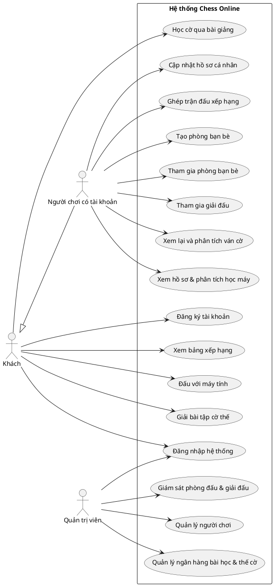

#### Mã Mermaid:
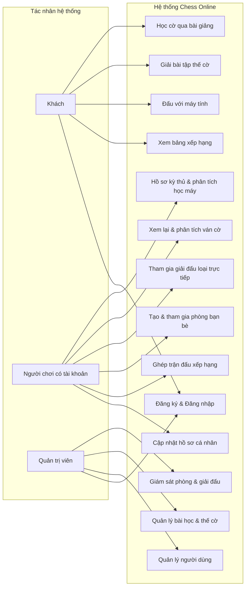

---

### 2.4 Biểu đồ Use Case phân rã cho từng tác nhân

#### 2.4.1 Phân rã Use Case cho tác nhân Khách

##### Mã PlantUML:
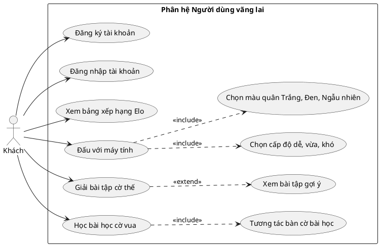

##### Mã Mermaid:
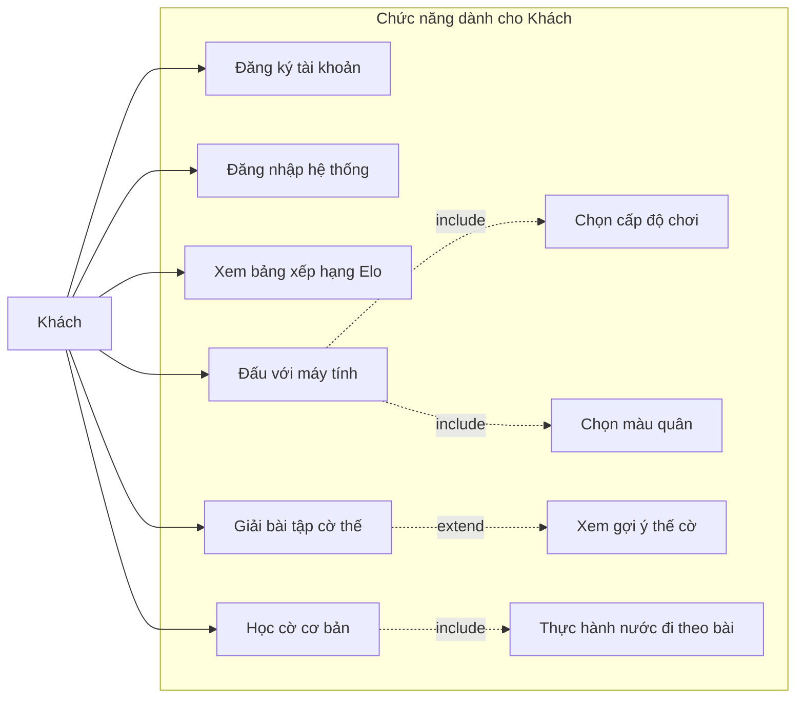

#### 2.4.2 Phân rã Use Case cho tác nhân Người chơi có tài khoản

##### Mã PlantUML:
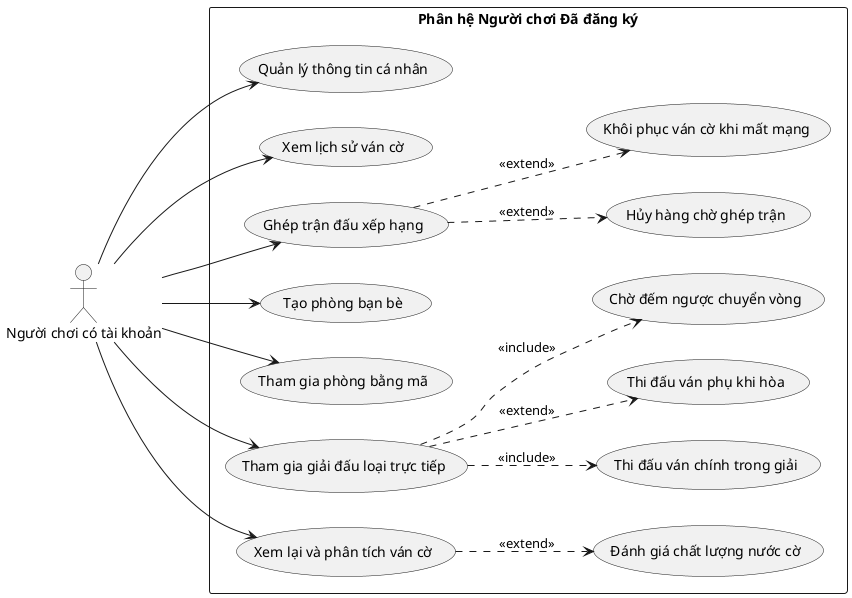

##### Mã Mermaid:
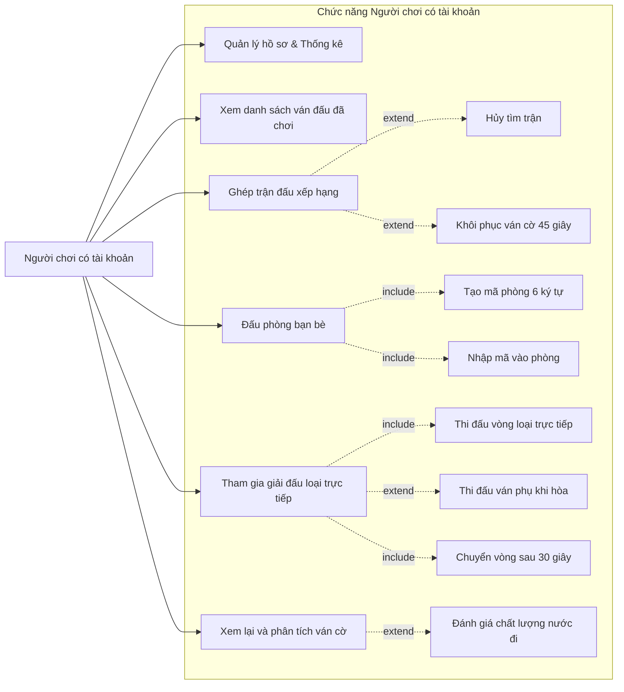

#### 2.4.3 Phân rã Use Case cho tác nhân Quản trị viên

##### Mã PlantUML:
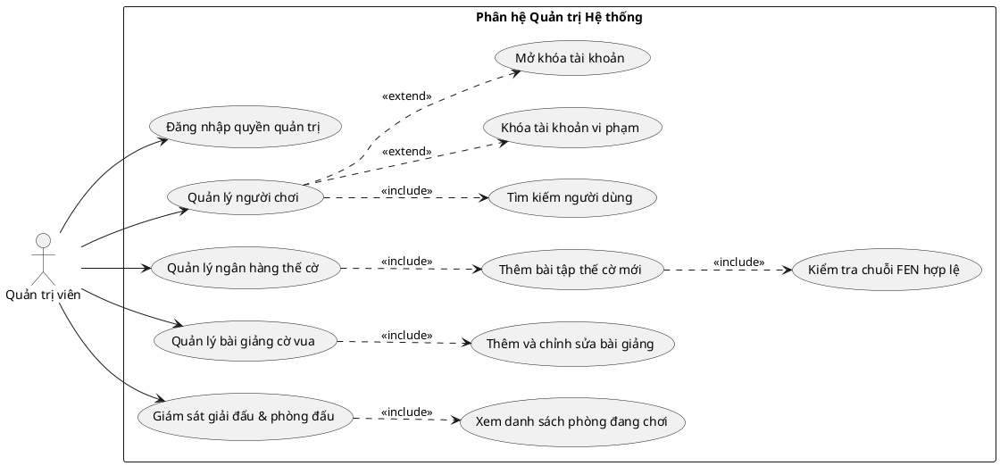

##### Mã Mermaid:
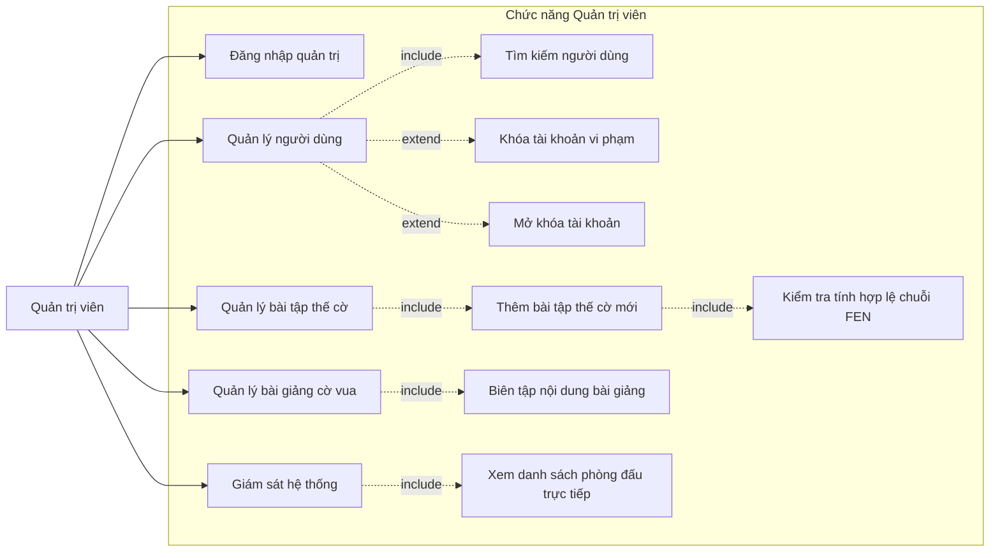

---

### 2.5 Biểu đồ trình tự các luồng nghiệp vụ cốt lõi

#### 2.5.1 Luồng 1: Ghép trận xếp hạng và đồng bộ nước đi thời gian thực

##### Mô tả luồng nghiệp vụ:
Người chơi A và Người chơi B cùng gửi yêu cầu ghép trận xếp hạng. Cổng kết nối đưa hai kỳ thủ vào hàng chờ, so khớp khoảng chênh lệch điểm Elo phù hợp, khởi tạo phòng đấu và chỉ định ngẫu nhiên màu quân. Sau khi ván cờ bắt đầu, người chơi gửi nước đi tới máy chủ. Máy chủ tiến hành kiểm tra xác thực định danh kết nối, kiểm tra tính hợp lệ của lượt đi, tính toán và trừ thời gian suy nghĩ vào quỹ giờ dựa trên mốc thời gian máy chủ, kiểm tra tính hợp lệ theo luật cờ quốc tế. Khi nước đi hợp lệ, máy chủ cập nhật trạng thái ván cờ và phát tán đồng bộ tới cả hai người chơi. Khi ván cờ kết thúc, hệ thống tính toán biến thiên điểm Elo và lưu trữ vào cơ sở dữ liệu.

##### Mã PlantUML:
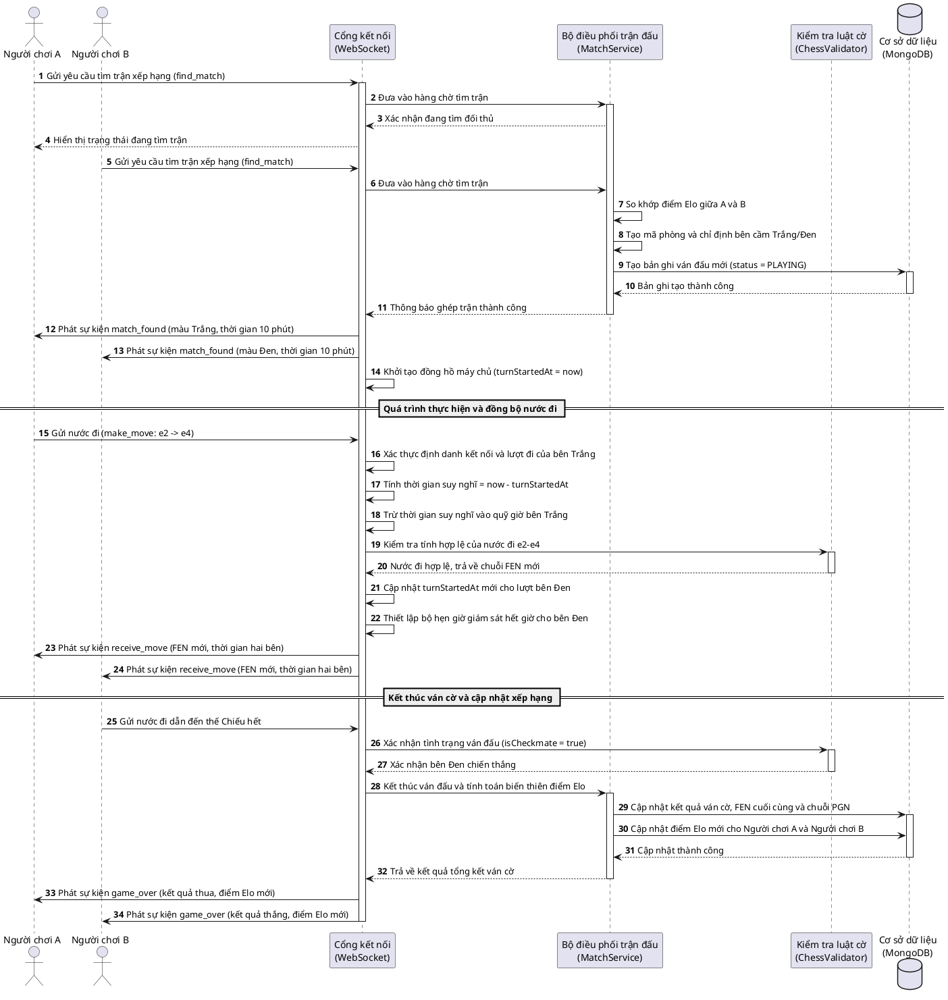

##### Mã Mermaid:
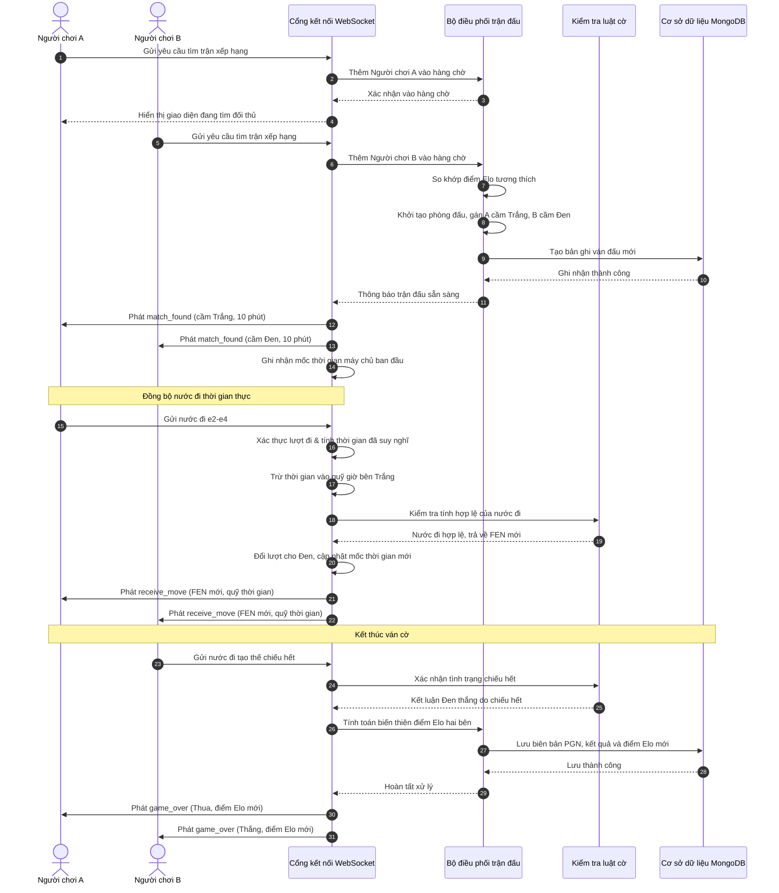

---

#### 2.5.2 Luồng 2: Tạm mất kết nối mạng và khôi phục ván cờ trong 45 giây

##### Mô tả luồng nghiệp vụ:
Trong quá trình ván đấu đang diễn ra, Người chơi A gặp sự cố đứt kết nối mạng hoặc thao tác tải lại trang trình duyệt. Cổng kết nối máy chủ phát hiện sự kiện đóng kết nối đột ngột, tuy nhiên hệ thống không xử thua ngay mà lập tức chuyển trạng thái phòng sang chế độ chờ kết nối lại. Đồng thời, máy chủ kích hoạt bộ đếm thời gian ân hạn 45 giây và gửi cảnh báo kèm đồng hồ đếm lùi tới Người chơi B. Khi Người chơi A kết nối lại trong thời hạn 45 giây và gửi yêu cầu khôi phục, máy chủ xác thực danh tính, hủy bỏ bộ đếm thời gian ân hạn, ánh xạ kết nối mới vào phòng đấu và hoàn trả nguyên vẹn trạng thái ván cờ (chuỗi FEN, lượt đi hiện tại, quỹ thời gian đã trừ bù chính xác) cho Người chơi A, đồng thời phát thông báo ván đấu tiếp tục tới Người chơi B. Nếu quá 45 giây mà Người chơi A không quay lại, máy chủ mới chính thức xử thua do bỏ cuộc.

##### Mã PlantUML:
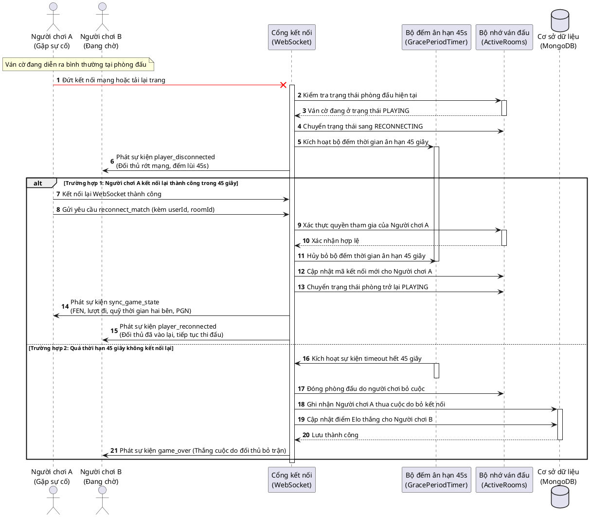

##### Mã Mermaid:
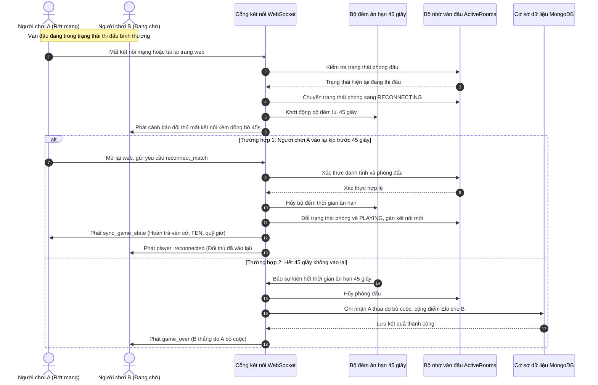

---

#### 2.5.3 Luồng 3: Vòng đời giải đấu loại trực tiếp (chia cặp, ván phụ khi hòa, chuyển vòng)

##### Mô tả luồng nghiệp vụ:
Chủ phòng khởi tạo giải đấu loại trực tiếp quy mô 4 người chơi và nhận mã mời tham gia. Các kỳ thủ khác nhập mã để ghi danh. Khi danh sách tham gia đủ 4 người, Chủ phòng ra lệnh bắt đầu giải đấu. Dịch vụ giải đấu tự động phân cặp bán kết theo sơ đồ nhánh đấu và tạo các phòng thi đấu tương ứng. Tại vòng bán kết, Trận 1 kết thúc có phân định thắng thua rõ ràng, kỳ thủ chiến thắng được đưa vào vị trí chờ ở trận chung kết. Tại Trận 2, hai kỳ thủ có kết quả hòa cờ. Do thể thức loại trực tiếp bắt buộc phải chọn ra một người đi tiếp, hệ thống tự động kích hoạt ván phụ thi đấu nhanh với màu quân đảo ngược so với ván chính; bên Trắng có 5 phút suy nghĩ, bên Đen có 4 phút suy nghĩ. Nếu ván phụ tiếp tục có kết quả hòa cờ, hệ thống áp dụng luật ưu thế cho bên cầm quân Đen giành quyền chiến thắng. Sau khi toàn bộ các cặp đấu của vòng bán kết kết thúc, hệ thống phát tín hiệu đếm ngược 30 giây nghỉ giữa hiệp cho các kỳ thủ chuẩn bị. Hết 30 giây, phòng thi đấu trận chung kết được tự động khởi tạo. Khi trận chung kết kết thúc, hệ thống công bố nhà vô địch và khép lại giải đấu.

##### Mã PlantUML:
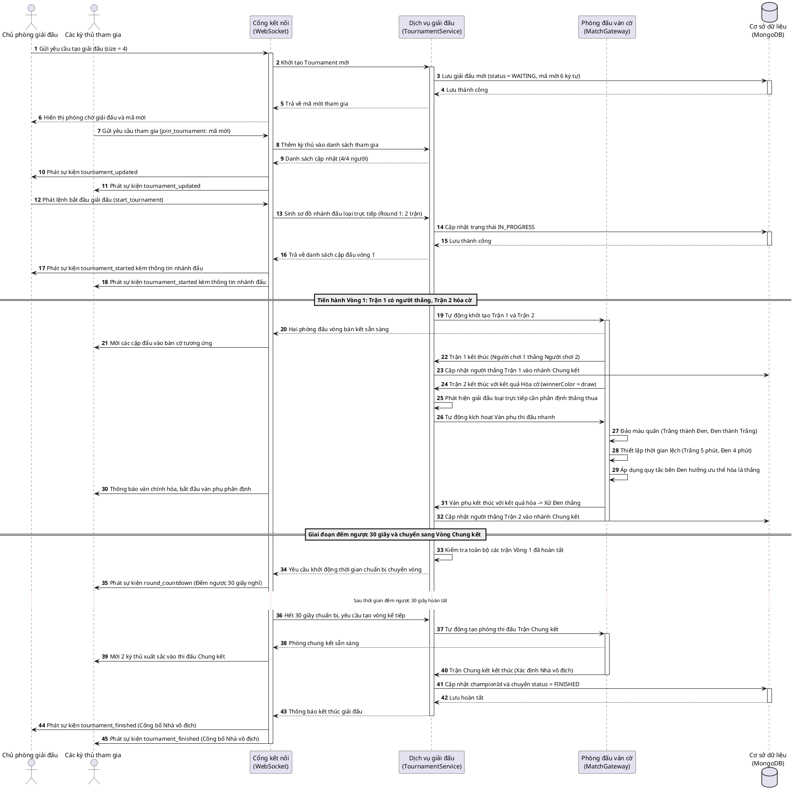

##### Mã Mermaid:
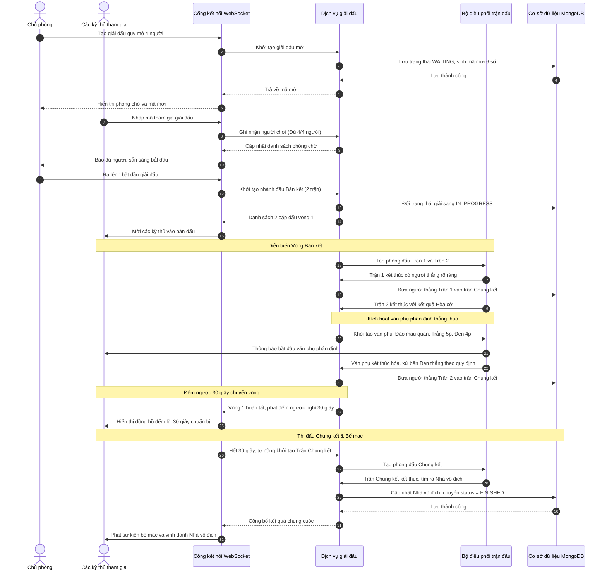

---

### 2.6 Bảng đặc tả Use Case chi tiết

#### 2.6.1 Đặc tả Use Case UC01: Đăng ký & Đăng nhập tài khoản

##### Bảng đặc tả Use Case:
| Thuộc tính | Nội dung mô tả chi tiết |
| :--- | :--- |
| **Mã Use Case** | **UC01** |
| **Tên Use Case** | **Đăng ký & Đăng nhập tài khoản** |
| **Tác nhân** | Khách, Người chơi có tài khoản |
| **Mô tả** | Cung cấp khả năng đăng ký tài khoản mới và xác thực đăng nhập vào hệ thống nhằm định danh người chơi, cấp phát quyền hạn và bảo vệ phiên làm việc. |
| **Sự kiện kích hoạt** | Người dùng bấm vào nút "Đăng ký" hoặc "Đăng nhập" trên thanh điều hướng đầu trang. |
| **Tiền điều kiện** | Với đăng ký: Người dùng chưa có tài khoản trên hệ thống. Với đăng nhập: Người dùng đã có tài khoản hợp lệ. |
| **Hậu điều kiện** | Người dùng được xác thực thành công, hệ thống cấp phát cặp mã phiên bảo mật và chuyển sang giao diện người dùng chính thức. |

##### Luồng sự kiện chính:
| STT | Thực hiện bởi | Hành động chi tiết |
| :---: | :--- | :--- |
| 1 | Người dùng | Lựa chọn chức năng Đăng ký hoặc Đăng nhập trên thanh điều hướng. |
| 2 | Hệ thống | Hiển thị biểu mẫu nhập liệu tương ứng. |
| 3 | Người dùng | Nhập các thông tin cần thiết vào các ô nhập liệu và bấm nút gửi yêu cầu. |
| 4 | Hệ thống | Kiểm tra tính đầy đủ của các trường thông tin bắt buộc. |
| 5 | Hệ thống | Kiểm tra định dạng địa chỉ thư điện tử và độ dài mật khẩu. |
| 6 | Hệ thống | Với Đăng ký: Kiểm tra tính duy nhất của thư điện tử và tên người dùng trong cơ sở dữ liệu, tiến hành băm mật khẩu một chiều và lưu bản ghi người dùng mới với điểm xếp hạng khởi tạo 1200. |
| 7 | Hệ thống | Với Đăng nhập: Đối chiếu mật khẩu nhập vào với mật khẩu đã băm trong cơ sở dữ liệu. |
| 8 | Hệ thống | Khởi tạo mã truy cập ngắn hạn lưu trong bộ nhớ tạm của ứng dụng và mã làm mới dài hạn lưu trong cookie bảo mật chỉ đọc. |
| 9 | Hệ thống | Điều hướng người dùng về trang chủ và hiển thị thông tin hồ sơ người chơi. |

##### Luồng sự kiện thay thế:
| STT | Thực hiện bởi | Hành động chi tiết |
| :---: | :--- | :--- |
| 4a | Hệ thống | Báo lỗi: Vui lòng điền đầy đủ các trường thông tin bắt buộc nếu người dùng bỏ trống ô dữ liệu. |
| 5a | Hệ thống | Báo lỗi: Địa chỉ thư điện tử không đúng định dạng quy định. |
| 5b | Hệ thống | Báo lỗi: Mật khẩu phải có độ dài tối thiểu 6 ký tự. |
| 6a | Hệ thống | Báo lỗi: Thư điện tử hoặc tên người dùng đã tồn tại trên hệ thống nếu bị trùng lặp khi đăng ký. |
| 7a | Hệ thống | Báo lỗi: Thông tin tài khoản hoặc mật khẩu không chính xác khi đăng nhập sai thông tin. |
| 7b | Hệ thống | Báo lỗi: Tài khoản của bạn đã bị khóa bởi quản trị viên nếu tài khoản mang trạng thái bị khóa. |

##### Bảng dữ liệu đầu vào chi tiết:
| STT | Trường dữ liệu | Mô tả | Bắt buộc? | Điều kiện hợp lệ | Ví dụ minh họa |
| :---: | :--- | :--- | :---: | :--- | :--- |
| 1 | `username` | Tên định danh người chơi | Có (khi đăng ký) | Chuỗi ký tự từ 3 đến 20 ký tự, không chứa ký tự đặc biệt | `hongson174765` |
| 2 | `email` | Địa chỉ thư điện tử | Có | Đúng định dạng thư điện tử hợp lệ | `hongson@example.com` |
| 3 | `password` | Mật khẩu xác thực | Có | Chuỗi ký tự có độ dài từ 6 đến 50 ký tự | `MatKhauBaoMat123` |
| 4 | `confirmPassword` | Xác nhận lại mật khẩu | Có (khi đăng ký) | Khớp hoàn toàn với trường `password` | `MatKhauBaoMat123` |

---

#### 2.6.2 Đặc tả Use Case UC02: Đấu với máy tính

##### Bảng đặc tả Use Case:
| Thuộc tính | Nội dung mô tả chi tiết |
| :--- | :--- |
| **Mã Use Case** | **UC02** |
| **Tên Use Case** | **Đấu với máy tính** |
| **Tác nhân** | Khách, Người chơi có tài khoản |
| **Mô tả** | Cho phép người chơi rèn luyện kỹ năng cờ vua bằng cách thi đấu đối kháng với thuật toán máy tính chạy trên luồng ngầm của trình duyệt web. |
| **Sự kiện kích hoạt** | Người dùng bấm chọn mục "Đấu với máy" trên giao diện menu chính. |
| **Tiền điều kiện** | Người dùng đã mở ứng dụng trên trình duyệt web có hỗ trợ JavaScript. |
| **Hậu điều kiện** | Trận đấu được khởi tạo, bàn cờ phản hồi mượt mà theo từng nước đi của người chơi và máy tính. |

##### Luồng sự kiện chính:
| STT | Thực hiện bởi | Hành động chi tiết |
| :---: | :--- | :--- |
| 1 | Người dùng | Chọn mục "Đấu với máy" từ menu chính. |
| 2 | Hệ thống | Hiển thị hộp thoại tùy chọn: Cấp độ chơi (Dễ, Trung bình, Khó) và Lựa chọn màu quân (Trắng, Đen, Ngẫu nhiên). |
| 3 | Người dùng | Lựa chọn cấp độ mong muốn, chọn màu quân và bấm nút "Bắt đầu". |
| 4 | Hệ thống | Khởi tạo luồng xử lý ngầm, nạp cấu hình thuật toán tìm kiếm nước đi tương ứng với cấp độ đã chọn. |
| 5 | Hệ thống | Khởi tạo bàn cờ với trạng thái ban đầu. Nếu người chơi chọn cầm quân Đen, máy tính tự động thực hiện nước đi đầu tiên cho bên Trắng. |
| 6 | Người dùng | Kéo thả hoặc bấm chọn quân cờ để thực hiện nước đi trên bàn cờ. |
| 7 | Hệ thống | Kiểm tra nước đi theo luật cờ vua. Nếu hợp lệ, cập nhật vị trí quân cờ và chuyển lượt cho máy tính. |
| 8 | Hệ thống | Luồng ngầm tính toán nước phản hồi dựa trên cây tìm kiếm vị trí và gửi kết quả về giao diện hiển thị. |
| 9 | Hệ thống | Cập nhật bàn cờ hiển thị nước đi của máy tính và chuyển lại lượt cho người chơi. |
| 10 | Hệ thống | Lặp lại các bước 6 đến 9 cho tới khi ván cờ kết thúc bằng kết quả Chiếu hết, Hòa cờ hoặc người chơi bấm nút Đầu hàng. |

##### Luồng sự kiện thay thế:
| STT | Thực hiện bởi | Hành động chi tiết |
| :---: | :--- | :--- |
| 7a | Hệ thống | Từ chối nước đi và trả quân cờ về vị trí cũ nếu nước đi vi phạm luật cờ vua. |
| 10a | Người dùng | Bấm nút "Chơi lại" để khởi động lại ván cờ mới với tùy chọn ban đầu. |
| 10b | Người dùng | Bấm nút "Xin gợi ý", luồng ngầm đề xuất một nước đi có lợi nhất tại thế cờ hiện tại. |

##### Bảng dữ liệu đầu vào chi tiết:
| STT | Trường dữ liệu | Mô tả | Bắt buộc? | Điều kiện hợp lệ | Ví dụ minh họa |
| :---: | :--- | :--- | :---: | :--- | :--- |
| 1 | `difficulty` | Cấp độ tính toán của máy | Có | Thuộc tập giá trị: `easy`, `medium`, `hard` | `medium` |
| 2 | `playerSide` | Màu quân người chơi lựa chọn | Có | Thuộc tập giá trị: `white`, `black`, `random` | `white` |
| 3 | `moveFrom` | Tọa độ ô cờ xuất phát | Có (khi đi cờ) | Chuỗi gồm 2 ký tự cột (a-h) và dòng (1-8) | `e2` |
| 4 | `moveTo` | Tọa độ ô cờ đích đến | Có (khi đi cờ) | Chuỗi gồm 2 ký tự cột (a-h) và dòng (1-8) | `e4` |
| 5 | `promotion` | Loại quân chọn khi phong cấp Tốt | Tùy chọn | Thuộc tập giá trị: `q`, `r`, `b`, `n` | `q` |

---

#### 2.6.3 Đặc tả Use Case UC03: Ghép trận đấu xếp hạng

##### Bảng đặc tả Use Case:
| Thuộc tính | Nội dung mô tả chi tiết |
| :--- | :--- |
| **Mã Use Case** | **UC03** |
| **Tên Use Case** | **Ghép trận đấu xếp hạng** |
| **Tác nhân** | Người chơi có tài khoản |
| **Mô tả** | Tự động ghép cặp hai kỳ thủ trực tuyến có điểm xếp hạng tương đương, giám sát ván cờ qua giao thức mạng thời gian thực và cập nhật điểm xếp hạng Elo sau khi kết thúc. |
| **Sự kiện kích hoạt** | Người chơi bấm nút "Tìm trận xếp hạng" tại sảnh chính. |
| **Tiền điều kiện** | Người chơi đã đăng nhập tài khoản và không trong trạng thái tham gia ván đấu khác. |
| **Hậu điều kiện** | Ván đấu được tạo lập, kết quả trận đấu và điểm Elo được lưu trữ vào cơ sở dữ liệu. |

##### Luồng sự kiện chính:
| STT | Thực hiện bởi | Hành động chi tiết |
| :---: | :--- | :--- |
| 1 | Người chơi | Chọn loại hình thời gian thi đấu (Chớp 3 phút, Nhanh 10 phút) và bấm nút "Tìm trận xếp hạng". |
| 2 | Hệ thống | Đưa người chơi vào hàng chờ ghép trận máy chủ và hiển thị hiệu ứng đang tìm đối thủ. |
| 3 | Hệ thống | So khớp người chơi với một kỳ thủ khác trong hàng chờ có mức chênh lệch điểm Elo trong giới hạn cho phép. |
| 4 | Hệ thống | Khởi tạo phòng đấu, phân định ngẫu nhiên bên cầm quân Trắng và bên cầm quân Đen, thiết lập đồng hồ thi đấu với mốc thời gian máy chủ. |
| 5 | Hệ thống | Phát thông báo ghép trận thành công tới cả hai người chơi kèm thông tin đối thủ. |
| 6 | Người chơi | Thực hiện nước đi trong lượt của mình và gửi lên máy chủ qua kết nối mạng thời gian thực. |
| 7 | Hệ thống | Kiểm tra định danh kết nối, kiểm tra tính hợp lệ của lượt đi, tính toán và trừ thời gian suy nghĩ vào quỹ giờ bên vừa đi. |
| 8 | Hệ thống | Kiểm tra tính hợp lệ của nước đi theo luật cờ vua. |
| 9 | Hệ thống | Cập nhật mốc thời gian chuyển lượt và phát tán nước cờ cùng chuỗi FEN mới tới hai người chơi. |
| 10 | Hệ thống | Khi ván cờ kết thúc (Chiếu hết, Hết giờ, Hòa cờ, Đầu hàng), máy chủ tính toán điểm Elo biến thiên của hai bên theo công thức quy định. |
| 11 | Hệ thống | Lưu bản ghi ván đấu và điểm xếp hạng mới vào cơ sở dữ liệu, đồng thời phát thông báo tổng kết cho hai người chơi. |

##### Luồng sự kiện thay thế:
| STT | Thực hiện bởi | Hành động chi tiết |
| :---: | :--- | :--- |
| 2a | Người chơi | Bấm nút "Hủy tìm trận", hệ thống xóa người chơi khỏi hàng chờ và đưa về màn hình chính. |
| 3a | Hệ thống | Mở rộng biên độ chênh lệch điểm Elo sau mỗi khoảng thời gian 10 giây nếu chưa tìm thấy đối thủ tương thích ngay lập tức. |
| 7a | Hệ thống | Đồng hồ đếm lùi của bên đang có lượt đi chạm mốc 0, hệ thống xử thua do hết giờ cho bên đó. |
| 8a | Hệ thống | Nước đi không hợp lệ, hệ thống từ chối cập nhật và gửi cảnh báo lỗi về máy khách của người đi. |
| 9a | Hệ thống | Người chơi bị ngắt kết nối mạng, hệ thống kích hoạt cơ chế ân hạn 45 giây để chờ người chơi vào lại. |

##### Bảng dữ liệu đầu vào chi tiết:
| STT | Trường dữ liệu | Mô tả | Bắt buộc? | Điều kiện hợp lệ | Ví dụ minh họa |
| :---: | :--- | :--- | :---: | :--- | :--- |
| 1 | `timeControl` | Cấu hình thời gian ván đấu | Có | Thuộc tập giá trị: `bullet_1m`, `blitz_3m`, `rapid_10m` | `rapid_10m` |
| 2 | `userId` | Mã định danh người chơi | Có | Chuỗi ký tự định danh tài khoản hợp lệ | `66d01a2b8e4f1a001c` |
| 3 | `eloRating` | Điểm xếp hạng hiện tại | Có | Số nguyên dương lớn hơn 0 | `1250` |
| 4 | `move` | Chuỗi nước đi dạng đại số | Có (khi đi cờ) | Định dạng hợp lệ theo quy định FIDE | `Nf3` |

---

#### 2.6.4 Đặc tả Use Case UC04: Tạo và tham gia phòng bạn bè

##### Bảng đặc tả Use Case:
| Thuộc tính | Nội dung mô tả chi tiết |
| :--- | :--- |
| **Mã Use Case** | **UC04** |
| **Tên Use Case** | **Tạo và tham gia phòng bạn bè** |
| **Tác nhân** | Người chơi có tài khoản |
| **Mô tả** | Cho phép người chơi tạo phòng đấu riêng với mã mời ngẫu nhiên 6 ký tự để mời bạn bè tham gia thi đấu giao hữu không ảnh hưởng tới điểm xếp hạng. |
| **Sự kiện kích hoạt** | Người chơi bấm chọn "Tạo phòng bạn bè" hoặc "Tham gia bằng mã". |
| **Tiền điều kiện** | Người chơi đã đăng nhập tài khoản. |
| **Hậu điều kiện** | Hai người chơi vào cùng một phòng đấu riêng biệt và tiến hành ván đấu giao hữu. |

##### Luồng sự kiện chính:
| STT | Thực hiện bởi | Hành động chi tiết |
| :---: | :--- | :--- |
| 1 | Người chơi A | Chọn chức năng "Tạo phòng bạn bè", lựa chọn cấu hình thời gian thi đấu và bấm "Tạo phòng". |
| 2 | Hệ thống | Khởi tạo phòng đấu riêng, sinh mã phòng gồm 6 ký tự ngẫu nhiên duy nhất và hiển thị lên màn hình. |
| 3 | Người chơi A | Sao chép mã phòng và gửi cho Người chơi B. |
| 4 | Người chơi B | Chọn chức năng "Tham gia phòng", nhập mã phòng gồm 6 ký tự và bấm "Vào phòng". |
| 5 | Hệ thống | Kiểm tra tính tồn tại của mã phòng và số lượng người hiện có trong phòng. |
| 6 | Hệ thống | Đưa Người chơi B vào phòng, thông báo cho Người chơi A và hiển thị trạng thái hai bên đã sẵn sàng. |
| 7 | Hệ thống | Bắt đầu ván đấu, hiển thị bàn cờ thời gian thực cho cả hai người chơi. |
| 8 | Hai người chơi | Tiến hành thi đấu theo các quy tắc đồng bộ nước đi và kiểm soát thời gian. |
| 9 | Hệ thống | Khi ván đấu kết thúc, hiển thị kết quả mà không tính toán biến thiên điểm Elo xếp hạng. |

##### Luồng sự kiện thay thế:
| STT | Thực hiện bởi | Hành động chi tiết |
| :---: | :--- | :--- |
| 2a | Người chơi A | Bấm nút "Rời phòng" trước khi có người vào, hệ thống hủy phòng đấu và trả về màn hình chính. |
| 5a | Hệ thống | Báo lỗi: Mã phòng không tồn tại hoặc đã hết hạn nếu người chơi nhập sai mã. |
| 5b | Hệ thống | Báo lỗi: Phòng đấu đã đủ 2 người chơi nếu có người thứ ba cố tình tham gia. |

##### Bảng dữ liệu đầu vào chi tiết:
| STT | Trường dữ liệu | Mô tả | Bắt buộc? | Điều kiện hợp lệ | Ví dụ minh họa |
| :---: | :--- | :--- | :---: | :--- | :--- |
| 1 | `timeControl` | Thời gian mỗi bên trong phòng | Có | Thuộc tập giá trị: `unlimited`, `5m`, `10m`, `15m` | `10m` |
| 2 | `roomCode` | Mã tham gia phòng bạn bè | Có (khi tham gia) | Chuỗi gồm chính xác 6 ký tự chữ hoa hoặc chữ số | `CF89A2` |

---

#### 2.6.5 Đặc tả Use Case UC05: Tham gia giải đấu loại trực tiếp

##### Bảng đặc tả Use Case:
| Thuộc tính | Nội dung mô tả chi tiết |
| :--- | :--- |
| **Mã Use Case** | **UC05** |
| **Tên Use Case** | **Tham gia giải đấu loại trực tiếp** |
| **Tác nhân** | Người chơi có tài khoản |
| **Mô tả** | Người chơi tổ chức hoặc ghi danh tham gia giải đấu thể thức loại trực tiếp 4 hoặc 8 người; hệ thống tự động sinh sơ đồ nhánh đấu, chuyển vòng sau 30 giây nghỉ và tự động kích hoạt ván phụ khi có kết quả hòa cờ. |
| **Sự kiện kích hoạt** | Người chơi bấm chọn "Giải đấu" từ thanh menu chính. |
| **Tiền điều kiện** | Người chơi đã đăng nhập tài khoản. |
| **Hậu điều kiện** | Giải đấu diễn ra tuần tự qua các vòng, tìm ra người chiến thắng chung cuộc và cập nhật danh hiệu. |

##### Luồng sự kiện chính:
| STT | Thực hiện bởi | Hành động chi tiết |
| :---: | :--- | :--- |
| 1 | Chủ phòng | Chọn tạo giải đấu mới, chọn quy mô (4 hoặc 8 người) và nhận mã mời giải đấu. |
| 2 | Các kỳ thủ | Nhập mã mời để ghi danh vào danh sách chờ của giải đấu. |
| 3 | Chủ phòng | Khi phòng chờ đã đủ số lượng người đăng ký, bấm nút "Bắt đầu giải đấu". |
| 4 | Hệ thống | Sinh sơ đồ phân nhánh thi đấu loại trực tiếp ngẫu nhiên và hiển thị cây thi đấu cho toàn thể kỳ thủ. |
| 5 | Hệ thống | Tự động tạo các phòng đấu cho các cặp đấu ở Vòng 1 và điều hướng các kỳ thủ vào bàn cờ. |
| 6 | Kỳ thủ | Thi đấu ván cờ theo quy định thi đấu trực tuyến thông thường. |
| 7 | Hệ thống | Khi ván đấu có người thắng: Cập nhật người thắng tiến vào vòng kế tiếp, người thua dừng bước. |
| 8 | Hệ thống | Khi ván đấu hòa: Tự động kích hoạt ván phụ thi đấu nhanh với màu quân đảo chiều, Trắng có 5 phút, Đen có 4 phút và Đen hưởng ưu thế hòa là thắng để phân định dứt điểm người đi tiếp. |
| 9 | Hệ thống | Khi toàn bộ các trận ở vòng hiện tại kết thúc: Kích hoạt đồng hồ đếm ngược 30 giây nghỉ chuẩn bị. |
| 10 | Hệ thống | Hết 30 giây: Tự động ghép cặp các kỳ thủ thắng cuộc ở vòng trước để tạo các trận đấu ở vòng tiếp theo. |
| 11 | Hệ thống | Lặp lại các bước đến khi trận chung kết kết thúc, vinh danh nhà vô địch và hoàn tất giải đấu. |

##### Luồng sự kiện thay thế:
| STT | Thực hiện bởi | Hành động chi tiết |
| :---: | :--- | :--- |
| 1a | Chủ phòng | Rời khỏi phòng trước khi bắt đầu giải, hệ thống hủy giải đấu và gửi thông báo tới các kỳ thủ khác. |
| 2a | Hệ thống | Từ chối yêu cầu tham gia nếu phòng giải đấu đã đủ số lượng người đăng ký. |
| 4a | Hệ thống | Nếu số lượng người tham gia là số lẻ khi bắt đầu, hệ thống tự động chỉ định một kỳ thủ được đi tiếp vào vòng sau mà không cần thi đấu ở vòng đầu. |

##### Bảng dữ liệu đầu vào chi tiết:
| STT | Trường dữ liệu | Mô tả | Bắt buộc? | Điều kiện hợp lệ | Ví dụ minh họa |
| :---: | :--- | :--- | :---: | :--- | :--- |
| 1 | `tournamentSize` | Số lượng kỳ thủ trong giải | Có | Thuộc tập giá trị: `4`, `8` | `4` |
| 2 | `tournamentCode` | Mã mời tham gia giải đấu | Có | Chuỗi gồm chính xác 6 ký tự chữ hoa | `TNMT01` |
| 3 | `tournamentId` | Mã định danh giải đấu | Hệ thống tự sinh | Chuỗi định danh duy nhất | `tour_98f12a` |

---

#### 2.6.6 Đặc tả Use Case UC06: Xem lại và phân tích ván cờ

##### Bảng đặc tả Use Case:
| Thuộc tính | Nội dung mô tả chi tiết |
| :--- | :--- |
| **Mã Use Case** | **UC06** |
| **Tên Use Case** | **Xem lại và phân tích ván cờ** |
| **Tác nhân** | Người chơi có tài khoản, Khách |
| **Mô tả** | Cho phép người chơi duyệt lại toàn bộ diễn biến ván cờ đã thi đấu theo từng nước đi, đồng thời sử dụng công cụ phân tích tự động để đánh giá chất lượng nước đi dựa trên độ suy giảm ưu thế. |
| **Sự kiện kích hoạt** | Người chơi bấm nút "Xem lại ván cờ" sau khi kết thúc trận đấu hoặc chọn một ván đấu từ mục Lịch sử thi đấu. |
| **Tiền điều kiện** | Ván đấu đã kết thúc và biên bản nước đi đã được lưu trữ trong cơ sở dữ liệu. |
| **Hậu điều kiện** | Giao diện bàn cờ hiển thị nước cờ kèm đánh giá trực quan về độ chính xác và sai lầm chiến thuật. |

##### Luồng sự kiện chính:
| STT | Thực hiện bởi | Hành động chi tiết |
| :---: | :--- | :--- |
| 1 | Người dùng | Bấm vào nút "Phân tích ván cờ" tại màn hình kết thúc ván hoặc chọn từ danh sách lịch sử ván cờ. |
| 2 | Hệ thống | Tải toàn bộ danh sách nước đi theo định dạng PGN và thông tin hai bên từ cơ sở dữ liệu. |
| 3 | Hệ thống | Hiển thị bàn cờ phân tích với thanh công cụ duyệt nước đi (Nước đầu, Nước trước, Nước sau, Nước cuối). |
| 4 | Người dùng | Bấm nút "Phân tích tự động". |
| 5 | Hệ thống | Kích hoạt luồng xử lý WebAssembly chạy ngầm công cụ phân tích Stockfish. |
| 6 | Hệ thống | Lần lượt gửi chuỗi vị trí FEN của từng nước đi tới công cụ phân tích để tính toán điểm số ưu thế. |
| 7 | Hệ thống | Tính toán độ suy giảm ưu thế giữa nước đi thực tế và nước đi tối ưu mà công cụ đề xuất. |
| 8 | Hệ thống | Phân loại từng nước cờ thành các cấp bậc: Nước tối ưu, Rất tốt, Tốt, Kém chính xác, Sai lầm, Sai lầm nghiêm trọng. |
| 9 | Hệ thống | Vẽ biểu đồ ưu thế của ván cờ theo thời gian và hiển thị mũi tên gợi ý nước đi tối ưu trên bàn cờ. |
| 10 | Người dùng | Bấm vào từng nước đi trong danh sách để xem thế cờ và lời giải thích chiến thuật tương ứng. |

##### Luồng sự kiện thay thế:
| STT | Thực hiện bởi | Hành động chi tiết |
| :---: | :--- | :--- |
| 5a | Hệ thống | Trình duyệt không hỗ trợ WebAssembly, hệ thống hiển thị thông báo yêu cầu người dùng cập nhật trình duyệt lên phiên bản mới hơn. |
| 6a | Người dùng | Bấm nút "Dừng phân tích", hệ thống tạm dừng luồng tính toán ngầm và giữ nguyên các kết quả đã xử lý được. |

##### Bảng dữ liệu đầu vào chi tiết:
| STT | Trường dữ liệu | Mô tả | Bắt buộc? | Điều kiện hợp lệ | Ví dụ minh họa |
| :---: | :--- | :--- | :---: | :--- | :--- |
| 1 | `matchId` | Mã định danh ván đấu cần xem | Có | Chuỗi định danh bản ghi ván cờ hợp lệ | `match_77a982c` |
| 2 | `analysisDepth` | Độ sâu tìm kiếm của công cụ | Tùy chọn | Số nguyên dương từ 10 đến 20 | `14` |

---

#### 2.6.7 Đặc tả Use Case UC07: Giải bài tập cờ thế và học cờ

##### Bảng đặc tả Use Case:
| Thuộc tính | Nội dung mô tả chi tiết |
| :--- | :--- |
| **Mã Use Case** | **UC07** |
| **Tên Use Case** | **Giải bài tập cờ thế và học cờ** |
| **Tác nhân** | Khách, Người chơi có tài khoản |
| **Mô tả** | Cung cấp kho thế cờ chiến thuật tương tác và các bài giảng bài bản giúp người chơi rèn luyện khả năng phát hiện đòn chiến thuật và nâng cao trình độ. |
| **Sự kiện kích hoạt** | Người dùng bấm chọn mục "Bài tập cờ thế" hoặc "Học cờ" trên thanh menu chính. |
| **Tiền điều kiện** | Người dùng truy cập vào hệ thống. |
| **Hậu điều kiện** | Hệ thống ghi nhận kết quả giải thế cờ, cập nhật tiến độ hoàn thành bài học vào hồ sơ cá nhân. |

##### Luồng sự kiện chính:
| STT | Thực hiện bởi | Hành động chi tiết |
| :---: | :--- | :--- |
| 1 | Người dùng | Chọn danh mục "Bài tập cờ thế" từ menu chính. |
| 2 | Hệ thống | Tải và hiển thị bài tập thế cờ phù hợp từ cơ sở dữ liệu kèm yêu cầu chiến thuật (Bên Trắng đi trước và giành ưu thế). |
| 3 | Người dùng | Quan sát bàn cờ và thực hiện nước đi bằng cách kéo thả quân cờ. |
| 4 | Hệ thống | Đối chiếu nước đi của người dùng với chuỗi nước đi giải pháp chính xác được lưu trong hệ thống. |
| 5 | Hệ thống | Nếu nước đi chính xác: Hệ thống tự động thực hiện nước cờ đáp trả của bên đối kháng theo lời giải bài tập. |
| 6 | Người dùng | Tiếp tục đi các nước tiếp theo cho đến khi hoàn thành toàn bộ chuỗi phối hợp chiến thuật. |
| 7 | Hệ thống | Hiển thị thông báo chúc mừng hoàn thành xuất sắc, cộng điểm rèn luyện và mở nút chuyển sang bài tập kế tiếp. |

##### Luồng sự kiện thay thế:
| STT | Thực hiện bởi | Hành động chi tiết |
| :---: | :--- | :--- |
| 4a | Hệ thống | Nếu nước đi không đúng lời giải: Hiển thị thông báo "Nước cờ chưa tối ưu, vui lòng thử lại" và đưa quân cờ về vị trí ban đầu. |
| 4b | Người dùng | Bấm nút "Xem lời giải", hệ thống hiển thị chuỗi nước đi mẫu nhưng không tính điểm hoàn thành bài tập cho người dùng. |

##### Bảng dữ liệu đầu vào chi tiết:
| STT | Trường dữ liệu | Mô tả | Bắt buộc? | Điều kiện hợp lệ | Ví dụ minh họa |
| :---: | :--- | :--- | :---: | :--- | :--- |
| 1 | `puzzleCategory` | Chủ đề đòn phối hợp chiến thuật | Tùy chọn | Thuộc danh mục: Ghim quân, Đòn xiên, Chiếu mở | `Pin` |
| 2 | `userMove` | Nước đi người dùng thực hiện | Có | Tọa độ ô cờ hợp lệ theo luật cờ vua | `Qxf7+` |

---

#### 2.6.8 Đặc tả Use Case UC08: Xem hồ sơ năng lực và chẩn đoán phong cách thi đấu bằng học máy

##### Bảng đặc tả Use Case:
| Thuộc tính | Nội dung mô tả chi tiết |
| :--- | :--- |
| **Mã Use Case** | **UC08** |
| **Tên Use Case** | **Xem hồ sơ năng lực và chẩn đoán phong cách thi đấu bằng học máy** |
| **Tác nhân** | Người chơi có tài khoản |
| **Mô tả** | Cung cấp giao diện trực quan hóa 8 đặc trưng thi đấu dưới dạng biểu đồ mạng nhện SVG, hiển thị nhãn phân cụm phong cách thi đấu K-Means, chẩn đoán giai đoạn thi đấu yếu nhất và đưa ra danh mục bài tập cờ thế cá nhân hóa. |
| **Sự kiện kích hoạt** | Người dùng bấm chọn mục "Hồ sơ kỳ thủ" trên thanh điều hướng bên trái. |
| **Tiền điều kiện** | Người dùng đã đăng nhập tài khoản vào hệ thống. |
| **Hậu điều kiện** | Giao diện hiển thị đầy đủ biểu đồ mạng nhện 8 trục, nhãn phong cách thi đấu, số lượng ván đấu đã phân tích và danh sách bài tập gợi ý. |

##### Luồng sự kiện chính:
| STT | Thực hiện bởi | Hành động chi tiết |
| :---: | :--- | :--- |
| 1 | Người dùng | Bấm chọn tab "Hồ sơ kỳ thủ" từ thanh điều hướng chính. |
| 2 | Hệ thống | Gửi yêu cầu API lấy dữ liệu hồ sơ phân tích của người chơi (`GET /api/v1/ml/profile`). |
| 3 | Hệ thống | Nếu người chơi đã có hồ sơ trong cơ sở dữ liệu: Trả về vector 8 đặc trưng, nhãn phong cách (Tiến công, Toàn diện, Đột biến hoặc Phòng thủ), phân tích điểm yếu 3 giai đoạn và danh sách bài tập gợi ý. |
| 4 | Hệ thống | Nếu người chơi chưa có hồ sơ: Tự động kích hoạt luồng tổng hợp dữ liệu từ các ván cờ đã lưu, chạy bộ chuẩn hóa StandardScaler và mô hình K-Means để phân cụm và lưu kết quả vào cơ sở dữ liệu. |
| 5 | Hệ thống | Dựng biểu đồ mạng nhện SVG 8 trục (Khai trận, Tính toán, Dứt điểm, Bảo toàn, Vững thế, Cẩn trọng, Bản lĩnh, Linh hoạt) kèm thang điểm 0–100. |
| 6 | Hệ thống | Hiển thị huy hiệu phong cách thi đấu, số lượng ván cờ đã phân tích gần nhất và khối gợi ý bài tập thích ứng. |
| 7 | Người dùng | Có thể bấm nút "Cập nhật lại hồ sơ" để yêu cầu hệ thống tính toán lại từ các ván đấu mới nhất. |

##### Luồng sự kiện thay thế:
| STT | Thực hiện bởi | Hành động chi tiết |
| :---: | :--- | :--- |
| 3a | Hệ thống | Người chơi chưa thi đấu ván cờ nào: Hiển thị trạng thái khởi tạo mặc định kèm thông báo cần thi đấu thêm ván cờ để hệ thống thu thập dữ liệu phong cách. |
| 7a | Hệ thống | Nếu quá trình tính toán lại gặp lỗi mạng: Giữ nguyên số liệu cũ và hiển thị thông báo thử lại. |

##### Bảng dữ liệu đầu vào chi tiết:
| STT | Trường dữ liệu | Mô tả | Bắt buộc? | Điều kiện hợp lệ | Ví dụ minh họa |
| :---: | :--- | :--- | :--- | :--- | :--- |
| 1 | `userId` | Mã định danh người chơi | Có | Định danh người dùng hợp lệ trong phiên đăng nhập | `usr_6631f` |
| 2 | `forceRecompute` | Cờ yêu cầu tính toán lại cưỡng bức | Tùy chọn | Boolean (`true`/`false`) | `true` |

---

### 2.7 Bảng ma trận kịch bản kiểm thử

| Mã ca kiểm thử | Tên ca kiểm thử | Mục đích kiểm thử | Tiền điều kiện | Các bước thực hiện | Dữ liệu đầu vào | Kết quả mong đợi | Kết quả kiểm thử |
| :---: | :--- | :--- | :--- | :--- | :--- | :--- | :---: |
| **TC01** | Kiểm tra tính hợp lệ nước đi và phong cấp Tốt | Xác minh máy chủ chấp nhận nước đi hợp lệ và cho phép phong cấp Tốt thành Hậu | Ván cờ đang thi đấu, quân Tốt Trắng ở ô e7 | 1. Người chơi đi Tốt từ e7 lên e8 2. Chọn phong cấp Hậu | Nước đi `e7e8q` | Nước đi được chấp nhận, ô e8 biến thành quân Hậu Trắng, FEN đồng bộ tới cả hai bên | **Đạt** |
| **TC02** | Ngăn chặn nước đi tự đặt Vua vào thế bị chiếu | Đảm bảo hệ thống từ chối mọi nước đi đẩy Vua của chính mình vào tầm tấn công của đối thủ | Ván cờ đang diễn ra, quân Xe đen đang kiểm soát cột e | 1. Người chơi bên Trắng di chuyển quân Mã đang che chắn Vua trên cột e đi nơi khác | Nước đi `Nd4` | Máy chủ từ chối nước đi, trả quân Mã về vị trí cũ, hiển thị cảnh báo vi phạm luật cờ | **Đạt** |
| **TC03** | Thực hiện nước cờ nhập thành hợp lệ | Xác minh Vua và Xe di chuyển đồng thời đúng quy tắc nhập thành gần | Vua Trắng ở e1, Xe ở h1, các ô f1 và g1 trống, chưa từng di chuyển | 1. Kéo quân Vua Trắng từ ô e1 sang ô g1 | Nước đi `O-O` (`e1g1`) | Vua chuyển sang g1, Xe tự động chuyển sang f1, quyền nhập thành của Trắng bị xóa trong chuỗi FEN | **Đạt** |
| **TC04** | Xử thua do hết giờ khi đối phương thiếu lực lượng chiếu hết | Kiểm tra luật cờ FIDE: Hết giờ nhưng đối phương chỉ còn Vua trần thì xử Hòa thay vì Thua | Bên Trắng hết giờ suy nghĩ, bên Đen chỉ còn duy nhất 1 quân Vua trên bàn cờ | 1. Đồng hồ bên Trắng đếm về 0 giây 2. Máy chủ kích hoạt kiểm tra lực lượng | Quỹ thời gian Trắng = 0 | Trận đấu kết thúc với kết quả Hòa cờ do đối phương không đủ lực lượng chiếu hết | **Đạt** |
| **TC05** | Khôi phục ván đấu thành công trong 45 giây | Kiểm tra cơ chế giữ trạng thái và đồng bộ lại khi người chơi bị rớt mạng và vào lại kịp thời | Trận đấu xếp hạng đang diễn ra bình thường | 1. Ngắt kết nối mạng của Người chơi A 2. Chờ 15 giây 3. Kết nối lại mạng và mở lại trang web | Sự kiện `reconnect_match` | Người chơi A nhận lại đầy đủ trạng thái ván cờ, đồng hồ tiếp tục chạy đúng mốc, ván cờ tiếp diễn | **Đạt** |
| **TC06** | Xử thua do bỏ cuộc khi quá 45 giây mất kết nối | Đảm bảo giải phóng phòng đấu và xử lý kết quả khi người chơi không quay lại sau thời gian ân hạn | Người chơi A bị ngắt kết nối mạng trong ván đấu | 1. Ngắt kết nối mạng của Người chơi A 2. Duy trì trạng thái ngắt mạng quá 45 giây | Đồng hồ ân hạn = 45 giây | Hết 45 giây, hệ thống tự động xử Người chơi A thua cuộc do bỏ trận, Người chơi B nhận điểm thắng | **Đạt** |
| **TC07** | Tự động kích hoạt ván phụ khi hòa trong giải đấu | Đảm bảo giải đấu loại trực tiếp tự kích hoạt ván phụ phân định thắng thua khi ván chính hòa cờ | Ván đấu bán kết trong giải đấu kết thúc với kết quả Hòa cờ | 1. Hai kỳ thủ đồng ý hòa hoặc hòa do bất biến vị trí 3 lần | Sự kiện kết thúc ván cờ với kết quả `draw` | Hệ thống thông báo bắt đầu ván phụ thi đấu nhanh, tự động đảo màu quân, Trắng có 5 phút, Đen có 4 phút | **Đạt** |
| **TC08** | Phân định thắng thua ván phụ khi kết quả tiếp tục hòa | Kiểm tra quy tắc ưu thế hòa: Nếu ván phụ kết thúc hòa thì bên cầm quân Đen được công nhận thắng | Ván phụ thi đấu nhanh kết thúc với kết quả hòa cờ | 1. Hết giờ hoặc hòa cờ trong ván phụ | Kết quả ván phụ là `draw` | Hệ thống tự động ghi nhận bên cầm quân Đen giành chiến thắng và đưa vào nhánh thi đấu Chung kết | **Đạt** |
| **TC09** | Xử lý hủy giải đấu khi Chủ phòng rời phòng chờ | Đảm bảo hệ thống dọn dẹp tài nguyên và gửi thông báo đúng đắn khi người tạo giải hủy giải | Giải đấu đang ở phòng chờ, đã có 3 kỳ thủ tham gia nhưng chưa bắt đầu | 1. Chủ phòng bấm nút thoát phòng giải đấu | Sự kiện rời phòng của Chủ phòng | Giải đấu bị hủy bỏ, hệ thống gửi thông báo giải đã bị hủy tới 2 kỳ thủ còn lại và đưa về trang chủ | **Đạt** |
| **TC10** | Đồng bộ chính xác đồng hồ thi đấu khi chuyển lượt | Xác minh giải thuật đồng hồ hướng sự kiện tính trừ thời gian chính xác theo mốc thời gian máy chủ | Ván cờ đang thi đấu, Người chơi A suy nghĩ 12 giây rồi thực hiện nước đi | 1. Người chơi A đi nước cờ sau 12 giây suy nghĩ | Nước đi kèm mốc thời gian máy chủ | Quỹ thời gian của A bị trừ chính xác 12 giây, mốc thời gian máy chủ mới được thiết lập cho lượt của B | **Đạt** |
| **TC11** | Phân cụm phong cách thi đấu bằng mô hình K-Means | Xác minh hệ thống chuẩn hóa vector đặc trưng và phân loại đúng vào 1 trong 4 nhóm phong cách | Người chơi có ít nhất 3 ván cờ có dữ liệu phân tích | 1. Người chơi mở tab Hồ sơ kỳ thủ 2. Hệ thống chạy `fit_transform` qua StandardScaler 3. Dự đoán cụm bằng K-Means | Vector 8 chiều đặc trưng | Người chơi được gán đúng nhãn cụm (Tiến công, Toàn diện, Đột biến, hoặc Phòng thủ), độ tin cậy được cập nhật | **Đạt** |
| **TC12** | Chẩn đoán điểm yếu và đề xuất bài tập cá nhân hóa | Kiểm tra hệ thống phát hiện chính xác giai đoạn có CPL cao nhất và lọc bài tập cờ thế theo Elo | Hồ sơ kỳ thủ ghi nhận CPL giai đoạn Tàn cuộc cao vượt trội so với Khai cuộc và Trung cuộc | 1. Hệ thống chạy bộ phân tích `WeaknessAnalyzer` 2. Gửi yêu cầu tới `RecommendationService` | CPL Tàn cuộc = 85, Elo = 1200 | Hệ thống chỉ định điểm yếu là Tàn cuộc, lọc ra các bài cờ thế chủ đề Tàn cuộc có dải Elo từ 1050 đến 1400 | **Đạt** |

---

# 3. YÊU CẦU PHI CHỨC NĂNG

### 3.1 Giao diện người dùng
- Giao diện được thiết kế hiện đại, tinh gọn và trực quan, hỗ trợ hiển thị linh hoạt trên cả màn hình máy tính bàn, máy tính xách tay và thiết bị di động thông minh.
- Bàn cờ hiển thị với độ tương phản cao, hỗ trợ kéo thả quân cờ mượt mà, hiển thị các chấm đánh dấu nước đi hợp lệ khi chạm hoặc chọn quân cờ.
- Âm thanh ván cờ (tiếng di chuyển quân cờ, tiếng ăn quân, tiếng chiếu tướng, tiếng kết thúc trận) được phát tức thì, đồng bộ chính xác với từng hành động trên màn hình.
- Cung cấp thông báo trạng thái rõ ràng, dễ hiểu khi kết nối gặp trục trặc, khi đối thủ tạm ngắt kết nối hoặc khi trận đấu kết thúc.

### 3.2 Hiệu năng hệ thống
- **Độ trễ truyền tải nước cờ:** Trong điều kiện mạng thông thường, thời gian từ khi người chơi gửi nước đi đến khi đối thủ nhận được trên màn hình không vượt quá 100 mili-giây.
- **Tối ưu hóa tài nguyên vi xử lý:** Áp dụng mô hình đồng hồ thi đấu hướng sự kiện, máy chủ không phát xung liên tục từng giây mà chỉ tính toán khi có nước đi, giúp máy chủ có thể duy trì hàng nghìn phòng đấu đồng thời với mức tải vi xử lý dưới 30%.
- **Xử lý tính toán độc lập:** Các tác vụ phân tích nước cờ của máy tính và công cụ phân tích được chạy hoàn toàn trên luồng xử lý ngầm của trình duyệt, không gây gián đoạn hoặc đơ cứng giao diện người dùng.

### 3.3 Độ tin cậy và tính sẵn sàng
- **Khả năng tự phục hồi tiến trình:** Hệ thống máy chủ được quản lý bằng trình giám sát tiến trình chuyên dụng, tự động khởi động lại ứng dụng trong vòng dưới 3 giây nếu xảy ra sự cố đột ngột.
- **Tính ổn định của ván cờ:** Cơ chế ân hạn 45 giây bảo vệ người chơi trước các sự cố mạng chập chờn hoặc thao tác vô tình bấm tải lại trang web, đảm bảo ván cờ không bị gián đoạn oan uổng.
- **Thời gian sẵn sàng hoạt động:** Hệ thống được cấu hình sẵn sàng phục vụ liên tục với tỷ lệ sẵn sàng đạt trên 99.5% thời gian hoạt động.

### 3.4 An toàn và bảo mật dữ liệu
- **Mã hóa lưu lượng đường truyền:** Toàn bộ dữ liệu trao đổi giữa máy khách và máy chủ qua cả hai giao thức web thông thường và kết nối thời gian thực đều được mã hóa bằng chứng chỉ bảo mật mã hóa giao vận phiên bản mới nhất.
- **Bảo mật mật khẩu:** Mật khẩu người dùng được băm một chiều bằng thuật toán mã hóa Bcrypt với hệ số muối phù hợp, không bao giờ lưu trữ dưới dạng văn bản thô trong cơ sở dữ liệu.
- **Cơ chế xác thực hai lớp mã phiên:** Mã truy cập ngắn hạn lưu trong bộ nhớ tạm nhằm ngăn ngừa mã độc đọc lén, mã làm mới dài hạn lưu trong cookie bảo mật chỉ đọc có gắn các cờ bảo vệ chống can thiệp từ mã kịch bản ngoài và chống giả mạo yêu cầu từ trang web khác.
- **Kiểm soát tính hợp lệ phía máy chủ:** Áp dụng nguyên tắc kiểm tra chặt chẽ, mọi nước cờ, thời gian suy nghĩ và quyền hạn thao tác đều do máy chủ phán quyết, ngăn ngừa hoàn toàn các hành vi gian lận sửa đổi mã nguồn phía máy khách.

### 3.5 Khả năng mở rộng
- **Cấu trúc phân tầng linh hoạt:** Dự án được tổ chức theo mô hình tách biệt rõ ràng giữa giao diện hiển thị và logic nghiệp vụ máy chủ, giúp dễ dàng nâng cấp hoặc thay thế từng phân hệ mà không ảnh hưởng tới toàn bộ hệ thống.
- **Khả năng mở rộng máy chủ phân tán:** Kiến trúc được thiết kế sẵn sàng để tích hợp lớp cơ sở dữ liệu bộ nhớ đệm trung gian phục vụ chia sẻ trạng thái ván cờ và điều phối tin nhắn giữa nhiều cụm máy chủ khi lượng người dùng tăng cao trong tương lai.
